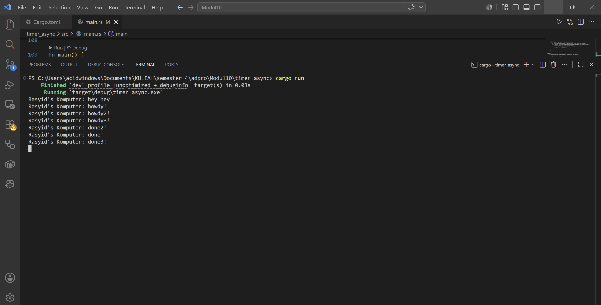

## Experiment 1.2

### Mengapa "hey hey" dicetak lebih dulu?
Fungsi spawner.spawn tidak langsung mengeksekusi blok async di dalamnya. Fungsi ini hanya bertugas mengirim (send) future atau task tersebut ke dalam channel antrean milik executor untuk dijalankan nanti. Eksekusi dari tasks yang ada di dalam antrean baru benar-benar dimulai ketika executor.run() dipanggil. Oleh karena itu, baris kode sinkronus println!("... hey hey") yang berada di luar async block akan dieksekusi terlebih dahulu oleh main thread sebelum antrean task mulai diproses oleh executor.

## Experiment 1.3

### Apa efek dari Multiple Spawn?
Saat melakukan multiple spawn, kita menambahkan banyak task baru ke dalam ready_queue. Executor dapat menangani dan memproses tasks tersebut secara konkuren (bergantian di waktu tunggu yang kosong). Semua pesan "howdy!" akan tercetak lebih dulu secara hampir bersamaan, baru kemudian jeda waktu (sleep) dieksekusi, lalu pesan "done!" tercetak.

### Apa yang terjadi saat drop(spawner) dihapus?
Program tidak akan pernah berhenti (terminate) dan terus berjalan tanpa henti. Hal ini terjadi karena fungsi executor.run() membaca task dari antrean menggunakan loop while let Ok(task) = self.ready_queue.recv(). Fungsi recv() pada channel akan terus dalam posisi blocking (menunggu) selama masih ada pengirim (Sender) yang hidup/aktif. Dengan memanggil drop(spawner), kita secara eksplisit menghancurkan Sender tersebut, sehingga channel ditutup dan recv() akan berhenti blocking, yang memungkinkan program selesai. Jika spawner tidak di-drop, executor mengira masih akan ada task baru yang dikirimkan ke depannya.