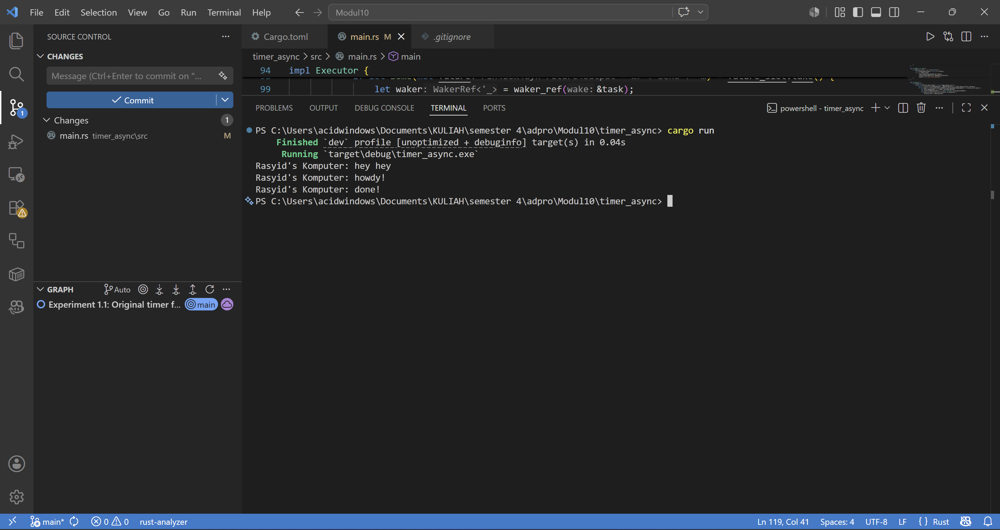

## Experiment 1.2

### Mengapa "hey hey" dicetak lebih dulu?
Fungsi spawner.spawn tidak langsung mengeksekusi blok async di dalamnya. Fungsi ini hanya bertugas mengirim (send) future atau task tersebut ke dalam channel antrean milik executor untuk dijalankan nanti. Eksekusi dari tasks yang ada di dalam antrean baru benar-benar dimulai ketika executor.run() dipanggil. Oleh karena itu, baris kode sinkronus println!("... hey hey") yang berada di luar async block akan dieksekusi terlebih dahulu oleh main thread sebelum antrean task mulai diproses oleh executor.